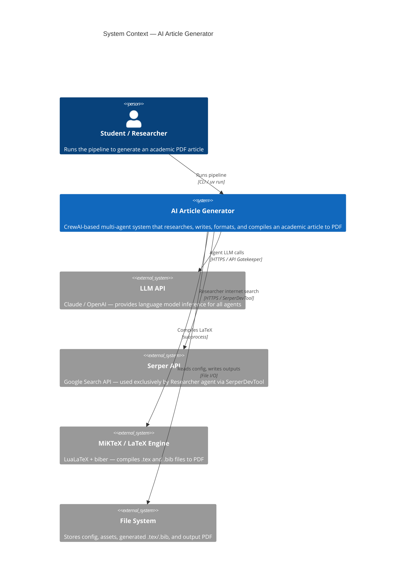
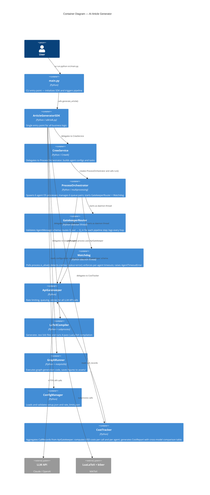
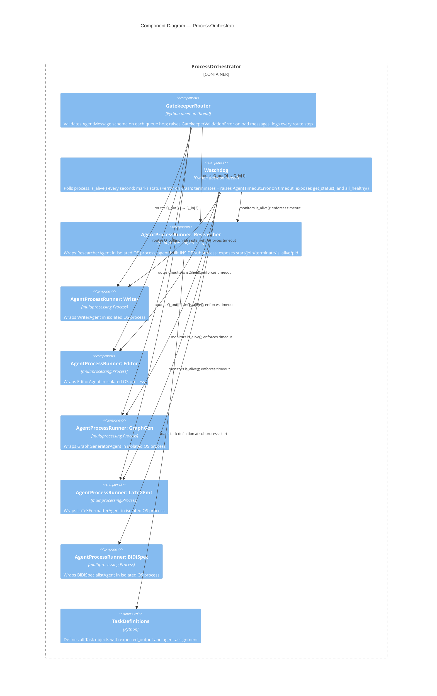
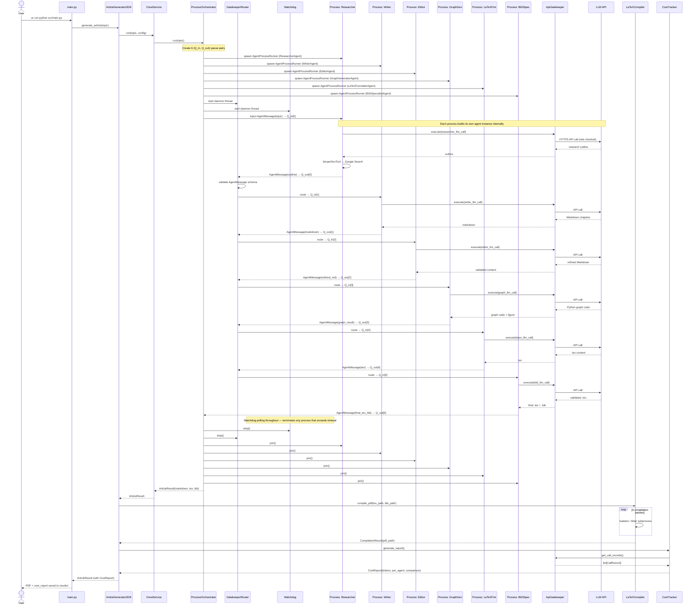
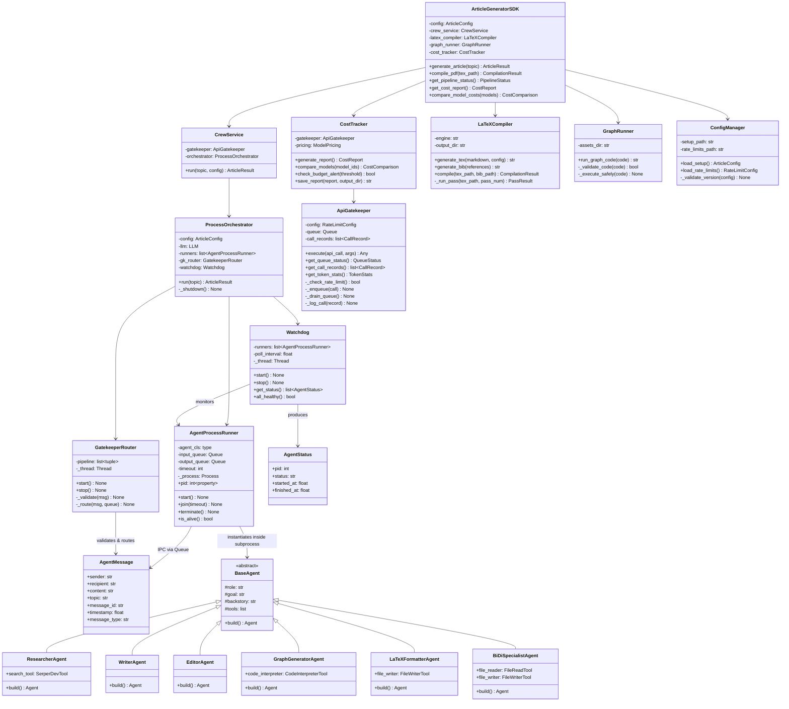
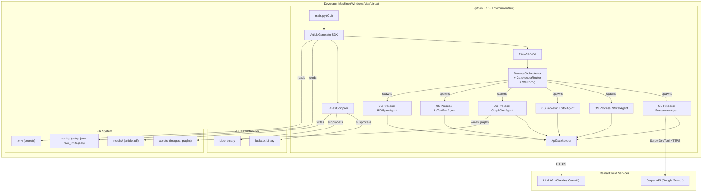

# PLAN.md — Architecture & Design Document
# AI Article Generator: Academic Article Production System

**Version:** 1.10  
**Date:** 2026-06-08  
**Course:** AI Agents — MSC Course, HW3  
**Lecturer:** Dr. Yoram Segal  

---

## 1. Architecture Overview

The system follows a **layered SDK architecture** with a single entry point. All business logic is accessible only through the SDK layer. External consumers (CLI, tests) never call internal services directly.

Each of the six CrewAI agents runs as an **isolated OS process** (`multiprocessing.Process`). Inter-agent communication is exclusively via typed `AgentMessage` objects passed through `multiprocessing.Queue` pairs. A `GatekeeperRouter` daemon thread validates every message and routes it to the next agent's input queue. A `Watchdog` daemon thread monitors process health and enforces per-agent timeouts.

```
┌──────────────────────────────────────────────────────────────┐
│                   External Consumers                         │
│               CLI (main.py) / Tests                          │
└───────────────────────────┬──────────────────────────────────┘
                            │
                            ▼
┌──────────────────────────────────────────────────────────────┐
│                 ArticleGeneratorSDK                          │  ← Single entry point
│                     sdk/sdk.py                               │
└───────────────────────────┬──────────────────────────────────┘
                            │
                            ▼
┌──────────────────────────────────────────────────────────────┐
│                  ProcessOrchestrator                         │
│  ┌──────────────────────────────────────────────────────┐    │
│  │  GatekeeperRouter (daemon thread)                    │    │
│  │    validates AgentMessage schema; routes Q_out→Q_in  │    │
│  ├──────────────────────────────────────────────────────┤    │
│  │  Watchdog (daemon thread)                            │    │
│  │    polls is_alive(); enforces timeouts               │    │
│  └──────────────────────────────────────────────────────┘    │
│                                                              │
│  Q_in → [OS Process: ResearcherAgent]  → Q_out              │
│  Q_in → [OS Process: WriterAgent]      → Q_out              │
│  Q_in → [OS Process: EditorAgent]      → Q_out              │
│  Q_in → [OS Process: GraphGenAgent]    → Q_out              │
│  Q_in → [OS Process: LaTeXFmtAgent]   → Q_out              │
│  Q_in → [OS Process: BiDiSpecAgent]   → Q_out              │
└──────────────────────────────────────────────────────────────┘
                            │
                            ▼
┌──────────────────────────────────────────────────────────────┐
│                     Infrastructure                           │
│  ApiGatekeeper │ ConfigManager │ LaTeXCompiler               │
│  LLM API       │ File System   │ LaTeX Engine                │
└──────────────────────────────────────────────────────────────┘
```

---

## 2. C4 Model

### 2.1 Level 1 — System Context



---

### 2.2 Level 2 — Container Diagram



---

### 2.3 Level 3 — Component Diagram (ProcessOrchestrator)



---

### 2.4 Level 4 — Code: Key Class Interfaces

#### `ArticleGeneratorSDK` — Primary Interface
```python
class ArticleGeneratorSDK:
    """Single entry point for all article generation operations."""

    def __init__(self, config_path: str = "config/setup.json") -> None: ...

    def generate_article(self) -> ArticleResult:
        """Run full pipeline: research → write → edit → format → compile."""
        ...

    def compile_pdf(self, tex_path: str) -> CompilationResult:
        """Compile an existing .tex file to PDF (4-pass LuaLaTeX + biber)."""
        ...

    def get_pipeline_status(self) -> PipelineStatus:
        """Return current stage, agent in progress, and queue depth."""
        ...

    def get_cost_report(self) -> CostReport:
        """Return full token usage breakdown, USD costs, and cross-model comparison."""
        ...

    def compare_model_costs(self, models: list[str]) -> CostComparison:
        """Project cost of current token usage across given LLM model identifiers."""
        ...
```

#### `ApiGatekeeper` — Required Interface (per guidelines §4.1)
```python
class ApiGatekeeper:
    """Centralized API call manager — all LLM calls MUST go through here."""

    def __init__(self, config: RateLimitConfig) -> None: ...

    def execute(self, api_call: Callable, *args, **kwargs) -> Any:
        """Check rate limits → queue if needed → retry on failure → log CallRecord."""
        ...

    def get_queue_status(self) -> QueueStatus:
        """Return queue depth and rate-window statistics."""
        ...

    def get_call_records(self) -> list[CallRecord]:
        """Return all logged CallRecords for cost analysis."""
        ...

    def get_token_stats(self) -> TokenStats:
        """Return aggregate input/output token counts across all calls."""
        ...
```

#### `CostTracker` — Cost Analysis Interface
```python
class CostTracker:
    """Aggregates token usage from ApiGatekeeper, computes USD costs, produces reports."""

    def __init__(self, gatekeeper: ApiGatekeeper, pricing: ModelPricing) -> None: ...

    def generate_report(self) -> CostReport:
        """Aggregate all CallRecords, compute per-agent costs, build cross-model table."""
        ...

    def compare_models(self, model_ids: list[str]) -> CostComparison:
        """Project same token volume across given model IDs using pricing config."""
        ...

    def check_budget_alert(self, threshold_usd: float) -> bool:
        """Return True and emit WARNING log if projected total cost > threshold."""
        ...

    def save_report(self, report: CostReport, output_dir: str) -> str:
        """Serialize CostReport to timestamped JSON file, return saved path."""
        ...
```

#### `AgentMessage` — IPC Message Dataclass
```python
@dataclass
class AgentMessage:
    """Typed IPC message passed between agent processes via multiprocessing.Queue."""

    sender: str           # Agent name that produced this message
    recipient: str        # Agent name that should consume this message
    content: str          # Serialized task output (markdown / code / tex)
    topic: str            # Article topic propagated through the pipeline
    message_id: str       # UUID4 assigned at creation
    timestamp: float      # time.time() at creation
    message_type: str     # "task_output" | "error" | "control"
```

#### `AgentStatus` — Process Health Dataclass
```python
@dataclass
class AgentStatus:
    """Snapshot of an agent process's health, set and read by Watchdog."""

    pid: int | None       # OS process ID (None before start)
    status: str           # "running" | "done" | "error" | "timeout"
    started_at: float     # time.time() when process was started
    finished_at: float | None  # time.time() when process exited (None if still running)
```

#### `AgentProcessRunner` — Process Wrapper
```python
class AgentProcessRunner:
    """Wraps a single CrewAI agent builder in an isolated OS process."""

    def __init__(
        self,
        agent_cls: type,          # Agent builder class (e.g. ResearcherAgent)
        input_queue: Queue,       # Receives AgentMessage from previous step
        output_queue: Queue,      # Sends AgentMessage to next step
        timeout: int = 300,       # Seconds before Watchdog terminates this process
    ) -> None: ...

    def start(self) -> None:
        """Spawn the OS process; agent is instantiated INSIDE the subprocess."""
        ...

    def join(self, timeout: float | None = None) -> None:
        """Wait for process to finish (blocks calling thread)."""
        ...

    def terminate(self) -> None:
        """Send SIGTERM to the subprocess; used by Watchdog on timeout."""
        ...

    def is_alive(self) -> bool:
        """Return True if the subprocess is still running."""
        ...

    @property
    def pid(self) -> int | None:
        """OS process ID, or None if not yet started."""
        ...
```

#### `GatekeeperRouter` — IPC Message Validator & Router
```python
class GatekeeperRouter:
    """Daemon thread that validates and routes AgentMessage objects between queues."""

    def __init__(
        self,
        pipeline: list[tuple[Queue, Queue]],  # [(Q_in, Q_out)] for each agent
    ) -> None: ...

    def start(self) -> None:
        """Start the daemon thread; runs until stop() is called."""
        ...

    def stop(self) -> None:
        """Signal the daemon thread to exit cleanly."""
        ...

    def _validate(self, msg: AgentMessage) -> None:
        """Raise GatekeeperValidationError if msg fails schema checks."""
        ...

    def _route(self, msg: AgentMessage, dest_queue: Queue) -> None:
        """Put validated message onto destination queue; log the hop."""
        ...
```

#### `Watchdog` — Process Health Monitor
```python
class Watchdog:
    """Daemon thread that monitors agent processes and enforces timeouts."""

    def __init__(
        self,
        runners: list[AgentProcessRunner],
        poll_interval: float = 1.0,
    ) -> None: ...

    def start(self) -> None:
        """Start the daemon thread."""
        ...

    def stop(self) -> None:
        """Signal the daemon thread to exit cleanly."""
        ...

    def get_status(self) -> list[AgentStatus]:
        """Return current AgentStatus snapshot for all runners."""
        ...

    def all_healthy(self) -> bool:
        """Return True if no runner has status 'error' or 'timeout'."""
        ...
```

#### `ProcessOrchestrator` — Top-Level Process Manager
```python
class ProcessOrchestrator:
    """Creates agent processes, manages IPC queues, and coordinates the full pipeline."""

    def __init__(self, config: ArticleConfig, llm: LLM) -> None: ...

    def run(self, topic: str) -> ArticleResult:
        """
        Full pipeline:
        1. Create 6 (Q_in, Q_out) queue pairs.
        2. Spawn 6 AgentProcessRunners.
        3. Start GatekeeperRouter + Watchdog as daemon threads.
        4. Inject initial AgentMessage into Researcher's Q_in.
        5. Collect final AgentMessage from BiDiSpecialist's Q_out.
        6. Clean shutdown: join all processes, stop router + watchdog.
        7. Return ArticleResult.
        """
        ...

    def _shutdown(self) -> None:
        """Terminate all processes cleanly; stop daemon threads."""
        ...
```

#### `LaTeXCompiler` — Compilation Interface
```python
class LaTeXCompiler:
    """Generates .tex/.bib files and runs multi-pass LaTeX compilation."""

    def generate_tex(self, markdown: str, config: ArticleConfig) -> str:
        """Convert Markdown article to complete .tex file."""
        ...

    def generate_bib(self, references: list[Reference]) -> str:
        """Generate .bib file content from structured reference list."""
        ...

    def compile(self, tex_path: str, bib_path: str) -> CompilationResult:
        """Run 4-pass LuaLaTeX + biber pipeline, return result."""
        ...
```

---

## 3. Source Code Structure

```
project-root/
├── src/
│   ├── article_generator/
│   │   ├── __init__.py
│   │   ├── constants.py                   # Immutable project constants
│   │   ├── sdk/
│   │   │   └── sdk.py                     # ArticleGeneratorSDK
│   │   ├── services/
│   │   │   ├── crew_service.py            # CrewAI Crew orchestration (delegates to ProcessOrchestrator)
│   │   │   ├── process_orchestrator.py    # ProcessOrchestrator: spawns 6 agent processes + manages queues
│   │   │   ├── gatekeeper_router.py       # GatekeeperRouter: validates & routes AgentMessage queue hops
│   │   │   ├── watchdog.py                # Watchdog: monitors process health, enforces timeouts
│   │   │   ├── latex_compiler.py          # .tex/.bib generation + compilation
│   │   │   ├── graph_runner.py            # Python graph execution
│   │   │   ├── file_manager.py            # File I/O operations
│   │   │   ├── cost_tracker.py            # CostTracker: token aggregation and USD cost reporting
│   │   │   ├── agents/
│   │   │   │   ├── __init__.py
│   │   │   │   ├── researcher.py          # ResearcherAgent definition (uses SerperDevTool)
│   │   │   │   ├── writer.py              # WriterAgent definition (NO internet tool)
│   │   │   │   ├── editor.py              # EditorAgent / Reviewer QC definition
│   │   │   │   ├── graph_generator.py     # GraphGeneratorAgent definition
│   │   │   │   ├── latex_formatter.py     # LaTeXFormatterAgent definition
│   │   │   │   └── bidi_specialist.py     # BiDiSpecialistAgent definition
│   │   │   ├── tools/
│   │   │   │   ├── __init__.py
│   │   │   │   └── search_tools.py        # SerperDevTool wrapper and tool factory
│   │   │   └── tasks/
│   │   │       ├── __init__.py
│   │   │       └── task_definitions.py    # All CrewAI Task objects
│   │   └── shared/
│   │       ├── gatekeeper.py              # ApiGatekeeper
│   │       ├── config.py                  # ConfigManager
│   │       ├── ipc_models.py              # AgentMessage and AgentStatus dataclasses
│   │       ├── process_runner.py          # AgentProcessRunner: one agent per OS process
│   │       └── version.py                 # Version tracking (1.00)
│   └── main.py                            # CLI entry point
├── tests/
│   ├── unit/
│   │   ├── test_sdk/
│   │   │   └── test_sdk.py
│   │   ├── test_services/
│   │   │   ├── test_crew_service.py
│   │   │   ├── test_process_orchestrator.py
│   │   │   ├── test_gatekeeper_router.py
│   │   │   ├── test_watchdog.py
│   │   │   ├── test_latex_compiler.py
│   │   │   ├── test_graph_runner.py
│   │   │   ├── test_file_manager.py
│   │   │   └── test_cost_tracker.py
│   │   ├── test_agents/
│   │   │   ├── test_researcher.py
│   │   │   ├── test_writer.py
│   │   │   ├── test_editor.py
│   │   │   ├── test_graph_generator.py
│   │   │   ├── test_latex_formatter.py
│   │   │   └── test_bidi_specialist.py
│   │   ├── test_tools/
│   │   │   └── test_search_tools.py
│   │   └── test_shared/
│   │       ├── test_gatekeeper.py
│   │       ├── test_config.py
│   │       ├── test_ipc_models.py
│   │       └── test_process_runner.py
│   ├── integration/
│   │   ├── test_pipeline.py
│   │   ├── test_latex_compilation.py
│   │   ├── test_process_isolation.py      # Verifies each agent runs in a separate OS process
│   │   └── test_ipc_message_passing.py    # End-to-end IPC: AgentMessage flows through all 6 queues
│   └── conftest.py                        # Shared fixtures
├── skills/                                # Active CrewAI skill folders (injected via skills= param)
│   ├── researcher/
│   │   └── SKILL.md                       # ResearcherAgent behavioral guidelines
│   ├── writer/
│   │   └── SKILL.md                       # WriterAgent behavioral guidelines
│   ├── editor/
│   │   └── SKILL.md                       # EditorAgent behavioral guidelines
│   ├── graph_generator/
│   │   └── SKILL.md                       # GraphGeneratorAgent behavioral guidelines
│   ├── latex_formatter/
│   │   └── SKILL.md                       # LaTeXFormatterAgent behavioral guidelines
│   └── bidi_specialist/
│       └── SKILL.md                       # BiDiSpecialistAgent behavioral guidelines
├── docs/
│   ├── PRD.md
│   ├── PLAN.md
│   ├── TODO.md
│   ├── PRD_crewai_agents.md
│   ├── PRD_latex_pipeline.md
│   ├── PRD_api_gatekeeper.md
│   ├── PRD_bibliography.md
│   ├── PRD_bidi.md
│   ├── PRD_graph_generation.md
│   ├── PRD_cost_tracker.md
│   ├── PRD_research_tools.md
│   └── PRD_skills.md
├── config/
│   ├── setup.json                         # Main app config (versioned)
│   ├── rate_limits.json                   # API rate limits (versioned)
│   └── model_pricing.json                 # LLM provider token pricing per million (versioned)
├── data/                                  # Reserved for input data
├── results/                               # Output PDF location
├── assets/                                # Images and generated graphs
├── notebooks/                             # Analysis notebooks
├── README.md
├── pyproject.toml
├── uv.lock
├── .env-example                       # Placeholder secrets: LLM_API_KEY, SERPER_API_KEY
└── .gitignore
```

---

## 4. UML Diagrams

### 4.1 Sequence Diagram — Full Pipeline



---

### 4.2 Class Diagram — Core Domain



---

### 4.3 Deployment Diagram



---

## 5. Architectural Decision Records (ADRs)

### ADR-001: CrewAI as Multi-Agent Orchestration Framework

| Field | Detail |
|-------|--------|
| **Status** | Accepted |
| **Decision** | Use CrewAI for multi-agent orchestration |
| **Context** | The pipeline requires multiple specialized agents working sequentially with defined roles, goals, and task handoffs |
| **Rationale** | CrewAI provides native support for sequential/hierarchical task flows, agent role/goal/backstory definitions, and tool integration — matching the assignment requirements exactly |
| **Alternatives considered** | LangGraph (more complex, graph-based; overkill for sequential pipeline), AutoGen (Microsoft; requires more setup; less clean task handoff model), Plain LangChain (no native agent orchestration; would require manual implementation) |
| **Trade-offs** | CrewAI abstracts the orchestration cleanly but locks into its agent model; custom control flow is less flexible than LangGraph |

---

### ADR-002: LuaLaTeX as LaTeX Compilation Engine

| Field | Detail |
|-------|--------|
| **Status** | Accepted |
| **Decision** | Use LuaLaTeX as the primary engine; XeLaTeX as fallback |
| **Context** | The document requires Hebrew–English BiDi text, which pdflatex does not support natively |
| **Rationale** | LuaLaTeX (and XeLaTeX) natively support Unicode, OpenType fonts, and the `polyglossia`/`bidi` packages required for Hebrew-English direction switching. This is mandated in Project.md |
| **Alternatives considered** | pdflatex — does NOT support Hebrew/BiDi natively; rejected. XeLaTeX — equally valid, kept as fallback in config |
| **Trade-offs** | LuaLaTeX is slower than pdflatex; acceptable given non-real-time use |

---

### ADR-003: Markdown-First Content Workflow

| Field | Detail |
|-------|--------|
| **Status** | Accepted |
| **Decision** | Agents generate Markdown first; LaTeX Formatter converts after content validation |
| **Context** | Directly generating LaTeX from agents risks structural errors that are hard to debug; Markdown is simpler and more reliable for content verification |
| **Rationale** | Explicitly recommended in Project.md: *"It is highly recommended that the crew first generates the output in Markdown format (for quick and easy review), and only after the content is approved and perfect, this agent will convert it to a .tex format"* |
| **Alternatives considered** | Direct LaTeX generation — rejected; higher error rate, harder to validate. HTML intermediate — unnecessary complexity |
| **Trade-offs** | Two-phase pipeline adds latency; the reliability gain outweighs the cost |

---

### ADR-004: Centralized API Gatekeeper Pattern

| Field | Detail |
|-------|--------|
| **Status** | Accepted |
| **Decision** | All LLM API calls routed through a single `ApiGatekeeper` instance |
| **Context** | Six agents make multiple LLM calls; uncontrolled calls risk rate limit errors and untracked costs |
| **Rationale** | Mandated by SOFTWARE_PROJECT_GUIDELINES.md §4.1: *"All external API calls MUST go through a centralized gatekeeper"* |
| **Alternatives considered** | Per-agent rate limiting — rejected; duplicates logic and breaks DRY. No rate limiting — rejected; violates guidelines and risks API bans |
| **Trade-offs** | Gatekeeper is a potential bottleneck; mitigated by FIFO queue and configurable concurrency |

---

### ADR-006: SerperDevTool for Researcher Agent Internet Search

| Field | Detail |
|-------|--------|
| **Status** | Accepted |
| **Decision** | Use `SerperDevTool` (from `crewai-tools`) as the internet search tool for the Researcher agent |
| **Context** | Project.md §2 explicitly mandates: *"It is mandatory to connect this agent to the internet using a search tool (e.g., SerperDevTool for Google search)"* |
| **Rationale** | `SerperDevTool` is the canonical CrewAI-native Google Search integration, requiring only a `SERPER_API_KEY`. It integrates directly as a CrewAI `BaseTool`, requiring no custom wrapper code. It is the example tool named explicitly in the assignment |
| **Alternatives considered** | `DuckDuckGoSearchTool` (no API key required but lower quality results), custom `requests` + Google API (requires more code and maintenance), `BrowserbaseLoadTool` (heavier, full browser automation; overkill for text research) |
| **Trade-offs** | Requires a paid/free-tier Serper API account; search results quality depends on query construction by the LLM |
| **Tool isolation rule** | Only the Researcher agent receives `SerperDevTool`. All other agents MUST NOT have any internet search tool. Non-search tools (`FileReadTool`, `FileWriterTool`, `CodeInterpreterTool`) are permitted on agents that need them — per Project.md §2: *"Do not connect this agent directly to an internet search tool"* |

---

### ADR-007: Dual-LLM Architecture — Claude and Gemini

| Field | Detail |
|-------|--------|
| **Status** | Accepted |
| **Decision** | Support both Anthropic Claude and Google Gemini as interchangeable LLM providers via a single `ACTIVE_LLM` environment variable toggle |
| **Context** | The project should not be locked to a single LLM vendor. Gemini offers competitive pricing (especially `gemini-2.0-flash`) and may be preferred depending on budget or availability |
| **Rationale** | A centralized `llm_factory.build_llm()` function reads `ACTIVE_LLM` from `.env`, selects the correct API key (`LLM_API_KEY` for Claude, `GEMINI_API_KEY` for Gemini), and returns a `crewai.LLM` instance. All 6 agents receive this instance at construction — no agent-level changes required |
| **Alternatives considered** | Hard-coded Claude — rejected; locks users to one vendor and one API key. Per-agent provider config — rejected; duplicates configuration and risks agents using different providers inconsistently |
| **Trade-offs** | Requires `crewai[google-genai]` extra dependency for Gemini; only one provider is active per run |

---

### ADR-008: Multi-Process Agent Isolation via `multiprocessing`

| Field | Detail |
|-------|--------|
| **Status** | Accepted |
| **Decision** | Each of the six CrewAI agents runs as an isolated OS process (`multiprocessing.Process`); agents communicate exclusively via typed `AgentMessage` objects passed through `multiprocessing.Queue` pairs |
| **Context** | The initial architecture ran all agents inside a single process via `crewai.Crew`. This gave no fault isolation: a crash or memory leak in one agent could terminate the entire pipeline. The course project mandates robustness and process-level isolation |
| **Rationale** | OS-level isolation ensures that a crash in one agent process cannot corrupt another agent's memory or state. Queue-based IPC provides a well-defined, inspectable contract between agents. The `GatekeeperRouter` validates every message at each hop, catching schema violations early. The `Watchdog` enforces timeouts and reports crashes, enabling graceful error handling instead of silent hangs |
| **Key constraint** | `crewai.LLM` and tool objects are **not picklable** and therefore cannot be passed across a process boundary via `Queue`. Each `AgentProcessRunner` passes only serializable configuration (agent builder class reference + topic string); the agent is instantiated **entirely inside the subprocess** |
| **Alternatives considered** | Thread-level isolation — rejected; Python GIL limits true parallelism and threads share memory, so a bug in one agent can still corrupt global state. `concurrent.futures.ProcessPoolExecutor` — rejected; requires picklable callables, incompatible with crewai agent objects. Keeping single-process — rejected; violates the architectural requirement |
| **Trade-offs** | Inter-process overhead (~50ms process spawn) is negligible compared to LLM API latency (seconds per call). Debugging across process boundaries is harder; mitigated by structured logging in `GatekeeperRouter` |

---

### ADR-005: `uv` as Sole Package Manager

| Field | Detail |
|-------|--------|
| **Status** | Accepted |
| **Decision** | Use `uv` exclusively; `pip` and `venv` are forbidden |
| **Context** | Project requires reproducible, locked dependencies across machines |
| **Rationale** | Mandated by SOFTWARE_PROJECT_GUIDELINES.md §7.4. `uv` is faster, produces a `uv.lock` for reproducibility, and is the standard in this course |
| **Alternatives considered** | pip + requirements.txt — forbidden per guidelines. Poetry — not specified; uv is mandatory |
| **Trade-offs** | `uv` is newer and less widely known; documentation must guide users clearly |

---

## 6. API Documentation & Interfaces

### 6.1 SDK Public Interface

| Method | Input | Output | Description |
|--------|-------|--------|-------------|
| `generate_article()` | — | `ArticleResult` | Full pipeline: research → write → format → compile |
| `compile_pdf(tex_path)` | `str` | `CompilationResult` | Compile existing `.tex` to PDF |
| `get_pipeline_status()` | — | `PipelineStatus` | Current stage + queue depth |
| `get_cost_report()` | — | `CostReport` | Token usage breakdown, USD costs, cross-model comparison |
| `compare_model_costs(models)` | `list[str]` | `CostComparison` | Project current token usage cost across given model IDs |

### 6.2 ApiGatekeeper Interface

| Method | Input | Output | Description |
|--------|-------|--------|-------------|
| `execute(api_call, *args, **kwargs)` | `Callable` | `Any` | Rate-check → queue → retry → log `CallRecord` |
| `get_queue_status()` | — | `QueueStatus` | Queue depth and rate-window stats |
| `get_call_records()` | — | `list[CallRecord]` | All logged call records for cost analysis |
| `get_token_stats()` | — | `TokenStats` | Aggregate input/output token counts across all calls |

### 6.3 LaTeXCompiler Interface

| Method | Input | Output | Description |
|--------|-------|--------|-------------|
| `generate_tex(markdown, config)` | `str`, `ArticleConfig` | `str` | Convert Markdown to `.tex` |
| `generate_bib(references)` | `list[Reference]` | `str` | Generate `.bib` file content |
| `compile(tex_path, bib_path)` | `str`, `str` | `CompilationResult` | 4-pass LuaLaTeX + biber |

### 6.4 CostTracker Interface

| Method | Input | Output | Description |
|--------|-------|--------|-------------|
| `generate_report()` | — | `CostReport` | Aggregate all CallRecords, compute per-agent costs, build cross-model table |
| `compare_models(model_ids)` | `list[str]` | `CostComparison` | Project same token volume across given model IDs |
| `check_budget_alert(threshold_usd)` | `float` | `bool` | True + WARNING log if projected cost > threshold |
| `save_report(report, output_dir)` | `CostReport`, `str` | `str` | Serialize to timestamped JSON, return saved path |

---

## 7. Data Schemas & Contracts

### 7.0 Required `.env` Keys
```
# LLM provider toggle — "claude" (default) or "gemini"
ACTIVE_LLM=claude

# Anthropic Claude — required when ACTIVE_LLM=claude
LLM_API_KEY=your_anthropic_api_key_here

# Google Gemini — required when ACTIVE_LLM=gemini
GEMINI_API_KEY=your_gemini_api_key_here

# Serper — always required for ResearcherAgent
SERPER_API_KEY=your_serper_api_key_here
```
> `SERPER_API_KEY` is required for the Researcher agent's `SerperDevTool`. Without it the pipeline will fail at Task 1.
> Only one of `LLM_API_KEY` or `GEMINI_API_KEY` is needed per run, depending on `ACTIVE_LLM`.

### 7.1 `ArticleConfig` (loaded from `config/setup.json`)
```json
{
  "version": "1.00",
  "article": {
    "topic": "string",
    "author": "string",
    "course": "string",
    "lecturer": "string",
    "date": "string",
    "language": "he-en",
    "target_pages": 15
  },
  "llm": {
    "model": "string",
    "temperature": 0.7
  },
  "paths": {
    "output_dir": "results/",
    "assets_dir": "assets/",
    "tex_filename": "article.tex",
    "bib_filename": "references.bib",
    "pdf_filename": "article.pdf"
  },
  "latex": {
    "engine": "lualatex",
    "compile_passes": 4
  }
}
```

### 7.2 `RateLimitConfig` (loaded from `config/rate_limits.json`)
```json
{
  "rate_limits": {
    "version": "1.00",
    "services": {
      "default": {
        "requests_per_minute": 30,
        "requests_per_hour": 500,
        "concurrent_max": 5,
        "retry_after_seconds": 30,
        "max_retries": 3,
        "max_queue_depth": 50
      }
    }
  }
}
```

### 7.3 `ArticleResult`
```python
@dataclass
class ArticleResult:
    success: bool
    markdown_content: str       # Final validated Markdown
    tex_path: str               # Path to generated .tex file
    bib_path: str               # Path to generated .bib file
    pdf_path: str               # Path to compiled PDF
    compilation: CompilationResult
    agent_outputs: list[AgentOutput]
    cost_report: CostReport     # Full token usage and cost breakdown for this run
```

### 7.4 `CompilationResult`
```python
@dataclass
class CompilationResult:
    success: bool
    passes_completed: int       # Number of LuaLaTeX passes run
    pdf_path: str
    errors: list[str]           # LaTeX error lines from log
    warnings: list[str]         # LaTeX warning lines from log
    log_path: str               # Path to full .log file
```

### 7.5 `AgentOutput`
```python
@dataclass
class AgentOutput:
    agent_name: str
    task_name: str
    status: str                 # "success" | "error"
    content: str                # Raw agent output
    input_tokens: int           # Tokens sent to LLM for this task
    output_tokens: int          # Tokens received from LLM for this task
    cost_usd: float             # USD cost for all calls in this task
    duration_seconds: float     # Wall-clock time for this task
```

### 7.6 `QueueStatus`
```python
@dataclass
class QueueStatus:
    queue_depth: int
    requests_this_minute: int
    requests_this_hour: int
    is_rate_limited: bool
    next_available_seconds: float
```

### 7.7 `CallRecord`
```python
@dataclass
class CallRecord:
    call_id: str                # UUID for this specific API call
    agent_name: str             # Which agent made the call
    model: str                  # e.g. "claude-sonnet-4-6"
    input_tokens: int
    output_tokens: int
    timestamp: str              # ISO-8601 UTC
    duration_seconds: float
    success: bool
```

### 7.8 `TokenStats`
```python
@dataclass
class TokenStats:
    total_input_tokens: int
    total_output_tokens: int
    total_tokens: int
    calls_count: int
    failed_calls_count: int
    avg_input_tokens_per_call: float
    avg_output_tokens_per_call: float
```

### 7.9 `AgentCostEntry`
```python
@dataclass
class AgentCostEntry:
    agent_name: str
    input_tokens: int
    output_tokens: int
    cost_usd: float
    percentage_of_total: float  # Share of total run cost (0–100)
```

### 7.10 `ModelCostEntry`
```python
@dataclass
class ModelCostEntry:
    provider: str               # e.g. "Anthropic", "OpenAI"
    model_id: str               # e.g. "claude-sonnet-4-6", "gpt-4o"
    input_cost_usd: float
    output_cost_usd: float
    total_cost_usd: float
    cost_ratio_vs_actual: float # e.g. 0.5 = half the cost of the actual run
```

### 7.11 `CostComparison`
```python
@dataclass
class CostComparison:
    input_tokens: int               # Token volume used for comparison (same as actual run)
    output_tokens: int
    actual_model: str               # Model actually used in this run
    actual_cost_usd: float
    entries: list[ModelCostEntry]   # One entry per compared model (≥ 3)
```

### 7.12 `CostReport`
```python
@dataclass
class CostReport:
    run_id: str                     # UUID for this pipeline run
    timestamp: str                  # ISO-8601 report generation time
    model_used: str                 # Primary model used in this run
    token_stats: TokenStats
    total_cost_usd: float
    per_agent_breakdown: list[AgentCostEntry]
    cross_model_comparison: CostComparison
    budget_alert_fired: bool
    report_path: str                # Absolute path where JSON was saved
```

### 7.13 `ModelPricing` (loaded from `config/model_pricing.json`)
```json
{
  "version": "1.00",
  "note": "Prices in USD per 1,000,000 tokens. Verify against official provider pricing pages.",
  "models": {
    "claude-opus-4-7": {
      "provider": "Anthropic",
      "input_cost_per_million_usd": 15.00,
      "output_cost_per_million_usd": 75.00
    },
    "claude-sonnet-4-6": {
      "provider": "Anthropic",
      "input_cost_per_million_usd": 3.00,
      "output_cost_per_million_usd": 15.00
    },
    "claude-haiku-4-5": {
      "provider": "Anthropic",
      "input_cost_per_million_usd": 0.25,
      "output_cost_per_million_usd": 1.25
    },
    "gpt-4o": {
      "provider": "OpenAI",
      "input_cost_per_million_usd": 5.00,
      "output_cost_per_million_usd": 15.00
    },
    "gpt-4o-mini": {
      "provider": "OpenAI",
      "input_cost_per_million_usd": 0.15,
      "output_cost_per_million_usd": 0.60
    }
  },
  "budget": {
    "alert_threshold_usd": 5.00,
    "max_budget_usd": 20.00
  }
}
```
